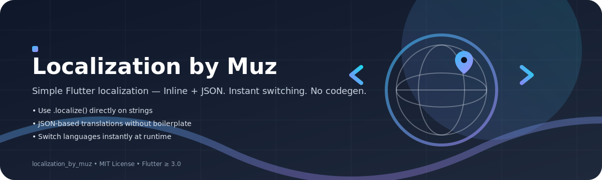

# Localization by Muz
 
 A simple Flutter package for easy localization with inline text support and JSON-based translations. No extra commands, no code generation - just add the package and start localizing!
 
## Features

- **Inline Localization**: Use `.localize()` method directly on strings with inline translations
- **JSON-based Localization**: Use a simple JSON file for organized translations
- **Instant Language Switching**: Change languages instantly without app restart
- **No Code Generation**: No need for build runner or code generation commands
- **Simple Setup**: Just add the package and start using

## Getting Started

Add the package to your `pubspec.yaml`:

```yaml
dependencies:
  localization_by_muz: ^1.0.2
```

## Usage

### Method 1: Inline Localization

```dart
import 'package:flutter/material.dart';
import 'package:localization_by_muz/localization_by_muz.dart';

class MyApp extends StatelessWidget {
  @override
  Widget build(BuildContext context) {
    return LocalizationProvider(
      defaultLocale: 'en',
      child: MaterialApp(
        home: MyHomePage(),
      ),
    );
  }
}

class MyHomePage extends StatelessWidget {
  @override
  Widget build(BuildContext context) {
    return Scaffold(
      appBar: AppBar(
        title: Text("Hello World!".localize({
          "en": "Hello World!",
          "fr": "Bonjour le monde!",
          "es": "¡Hola Mundo!"
        })),
      ),
      body: Column(
        children: [
          Text("Welcome".localize({
            "en": "Welcome",
            "fr": "Bienvenue",
            "es": "Bienvenido"
          })),
          ElevatedButton(
            onPressed: () => LocalizationProvider.setLocale(context, 'fr'),
            child: Text("Switch to French"),
          ),
          ElevatedButton(
            onPressed: () => LocalizationProvider.setLocale(context, 'en'),
            child: Text("Switch to English"),
          ),
        ],
      ),
    );
  }
}
```

### Method 2: JSON-based Localization

1. Create a `localization.json` file in your `lib/` directory (required path for this package):

```json
{
  "helloWorld": {
    "en": "Hello World",
    "fr": "Bonjour Le Monde",
    "es": "Hola Mundo"
  },
  "welcome": {
    "en": "Welcome", 
    "fr": "Bienvenue",
    "es": "Bienvenido"
  },
  "goodbye": {
    "en": "Goodbye",
    "fr": "Au revoir", 
    "es": "Adiós"
  }
}
```

2. Add it to your app's `pubspec.yaml` assets so Flutter bundles it:

```yaml
flutter:
  assets:
    - lib/localization.json
```

> Note: The package reads from `lib/localization.json` via `rootBundle`. Keep this exact path and add it to assets as shown above.

3. Use in your Flutter app:

```dart
import 'package:flutter/material.dart';
import 'package:localization_by_muz/localization_by_muz.dart';

class MyApp extends StatelessWidget {
  @override
  Widget build(BuildContext context) {
    return LocalizationProvider(
      defaultLocale: 'en',
      child: MaterialApp(
        home: MyHomePage(),
      ),
    );
  }
}

class MyHomePage extends StatelessWidget {
  @override
  Widget build(BuildContext context) {
    return Scaffold(
      appBar: AppBar(
        title: Text("helloWorld".localize()),
      ),
      body: Column(
        children: [
          Text("welcome".localize()),
          Text("goodbye".localize()),
          ElevatedButton(
            onPressed: () => LocalizationProvider.setLocale(context, 'fr'),
            child: Text("Switch to French"),
          ),
          ElevatedButton(
            onPressed: () => LocalizationProvider.setLocale(context, 'es'),
            child: Text("Switch to Spanish"),
          ),
        ],
      ),
    );
  }
}
```

### Language Switching

To change the language instantly:

```dart
LocalizationProvider.setLocale(context, 'fr'); // Switch to French
LocalizationProvider.setLocale(context, 'en'); // Switch to English
LocalizationProvider.setLocale(context, 'es'); // Switch to Spanish
```

The UI will update instantly without requiring app restart or refresh!

## Features Breakdown

- **Two localization methods**: Choose between inline translations or JSON file approach
- **Instant updates**: Language changes reflect immediately in the UI
- **Zero configuration**: No build runner or code generation required
- **Simple API**: Just use `.localize()` on any string
- **Fallback support**: If translation not found, returns original text
- **Provider pattern**: Efficient state management using Flutter's provider pattern

## Additional Information

This package is designed to make Flutter localization as simple as possible. Whether you prefer inline translations for small projects or JSON files for larger applications, this package has you covered.

For issues and feature requests, please visit our GitHub repository.

## Author

**Muzamil Ghafoor**

- GitHub: [@muzzammil763](https://github.com/muzzammil763)

---

Made By Muzamil Ghafoor With ❤️ For The Flutter Developers To Make Localization Easy